# Execution Plan

## Detailed Analysis Summary

### Change Impact Assessment
- **User-facing changes**: Yes - 고객 주문 UI, 관리자 대시보드, 슈퍼 관리자 모니터링
- **Structural changes**: Yes - 신규 프로젝트, 전체 아키텍처 설계 필요
- **Data model changes**: Yes - 매장, 테이블, 메뉴, 옵션, 주문 등 다수 엔티티
- **API changes**: Yes - REST API 전체 설계 필요
- **NFR impact**: Yes - SSE 실시간 통신, 세션 관리

### Risk Assessment
- **Risk Level**: Medium (신규 프로젝트이나 잘 정의된 요구사항)
- **Rollback Complexity**: Easy (Greenfield)
- **Testing Complexity**: Moderate (SSE 실시간 통신, 다중 사용자 유형)

## Workflow Visualization

```mermaid
flowchart TD
    Start(["User Request"])
    
    subgraph INCEPTION["INCEPTION PHASE"]
        WD["Workspace Detection<br/>COMPLETED"]
        RA["Requirements Analysis<br/>COMPLETED"]
        US["User Stories<br/>COMPLETED"]
        WP["Workflow Planning<br/>COMPLETED"]
        AD["Application Design<br/>EXECUTE"]
        UG["Units Generation<br/>EXECUTE"]
    end
    
    subgraph CONSTRUCTION["CONSTRUCTION PHASE"]
        FD["Functional Design<br/>EXECUTE"]
        NFRA["NFR Requirements<br/>EXECUTE"]
        NFRD["NFR Design<br/>EXECUTE"]
        CG["Code Generation<br/>EXECUTE"]
        BT["Build and Test<br/>EXECUTE"]
    end
    
    Start --> WD
    WD --> RA --> US --> WP
    WP --> AD --> UG
    UG --> FD --> NFRA --> NFRD
    NFRD --> CG --> BT
    BT --> End(["Complete"])
    
    style WD fill:#4CAF50,stroke:#1B5E20,stroke-width:3px,color:#fff
    style RA fill:#4CAF50,stroke:#1B5E20,stroke-width:3px,color:#fff
    style US fill:#4CAF50,stroke:#1B5E20,stroke-width:3px,color:#fff
    style WP fill:#4CAF50,stroke:#1B5E20,stroke-width:3px,color:#fff
    style AD fill:#FFA726,stroke:#E65100,stroke-width:3px,stroke-dasharray: 5 5,color:#000
    style UG fill:#FFA726,stroke:#E65100,stroke-width:3px,stroke-dasharray: 5 5,color:#000
    style FD fill:#FFA726,stroke:#E65100,stroke-width:3px,stroke-dasharray: 5 5,color:#000
    style NFRA fill:#FFA726,stroke:#E65100,stroke-width:3px,stroke-dasharray: 5 5,color:#000
    style NFRD fill:#FFA726,stroke:#E65100,stroke-width:3px,stroke-dasharray: 5 5,color:#000
    style CG fill:#4CAF50,stroke:#1B5E20,stroke-width:3px,color:#fff
    style BT fill:#4CAF50,stroke:#1B5E20,stroke-width:3px,color:#fff
    style Start fill:#CE93D8,stroke:#6A1B9A,stroke-width:3px,color:#000
    style End fill:#CE93D8,stroke:#6A1B9A,stroke-width:3px,color:#000
    style INCEPTION fill:#BBDEFB,stroke:#1565C0,stroke-width:3px,color:#000
    style CONSTRUCTION fill:#C8E6C9,stroke:#2E7D32,stroke-width:3px,color:#000
    linkStyle default stroke:#333,stroke-width:2px
```



### Text Alternative
```
INCEPTION PHASE:
  Workspace Detection (COMPLETED) -> Requirements Analysis (COMPLETED)
  -> User Stories (COMPLETED) -> Workflow Planning (COMPLETED)
  -> Application Design (EXECUTE) -> Units Generation (EXECUTE)

CONSTRUCTION PHASE:
  Functional Design (EXECUTE) -> NFR Requirements (EXECUTE)
  -> NFR Design (EXECUTE) -> Code Generation (EXECUTE)
  -> Build and Test (EXECUTE)
```

## Phases to Execute

### INCEPTION PHASE
- [x] Workspace Detection (COMPLETED)
- [x] Reverse Engineering (SKIP - Greenfield)
- [x] Requirements Analysis (COMPLETED)
- [x] User Stories (COMPLETED)
- [x] Workflow Planning (IN PROGRESS)
- [ ] Application Design - EXECUTE
  - **Rationale**: 신규 프로젝트로 컴포넌트 식별, 서비스 레이어 설계, API 설계 필요
- [ ] Units Generation - EXECUTE
  - **Rationale**: Backend/Frontend 분리 및 기능 단위 분해 필요 (36개 스토리, 다중 컴포넌트)

### CONSTRUCTION PHASE (Per-Unit)
- [ ] Functional Design - EXECUTE
  - **Rationale**: 데이터 모델(매장/테이블/메뉴/옵션/주문), 비즈니스 로직(세션 관리, 주문 처리) 상세 설계 필요
- [ ] NFR Requirements - EXECUTE
  - **Rationale**: SSE 실시간 통신, 세션 관리, 파일 업로드 등 기술 요구사항 정의 필요
- [ ] NFR Design - EXECUTE
  - **Rationale**: NFR 패턴(SSE, JWT 대체 세션, 파일 저장) 설계 필요
- [ ] Infrastructure Design - SKIP
  - **Rationale**: 로컬 개발 환경 우선, 클라우드 인프라 불필요
- [ ] Code Generation - EXECUTE (ALWAYS)
  - **Rationale**: 구현 필수
- [ ] Build and Test - EXECUTE (ALWAYS)
  - **Rationale**: 빌드 및 테스트 필수

### OPERATIONS PHASE
- [ ] Operations - PLACEHOLDER

## Success Criteria
- **Primary Goal**: 프리미엄 카페 테이블오더 MVP 구현
- **Key Deliverables**: Spring Boot Backend, React Frontend, H2 DB, SSE 실시간 통신
- **Quality Gates**: 전체 유닛 테스트, 주문 플로우 E2E 검증
